Cross Validation
================

Example
-------

Simulate data

``` r
nonlin_df = tibble(
  id = 1:100,
  x = runif(100, 0, 1),
  y = 1 - 10 * (x - .3) ^ 2 + rnorm(100, 0, .3) # nonlinear function of x
)

ggplot(nonlin_df, aes(x = x, y = y)) + geom_point() + theme_bw()
```

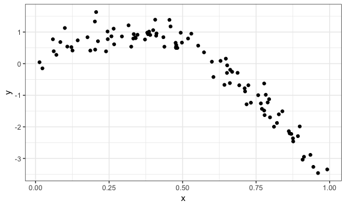

Partition into training and testing

``` r
# ?sample_n

# create the training dataset with 80 samples in the dataframe 
# (the samples are not put in order)
train_df = sample_n(nonlin_df, 80)

# put the samples left in the test dataset
# give me everything from nonlin_df dataset that are not in the train_df dataset
test_df = anti_join(nonlin_df, train_df, by = "id")

ggplot(train_df, aes(x = x, y = y)) + 
  geom_point() + 
  geom_point(data = test_df, color = "red")
```

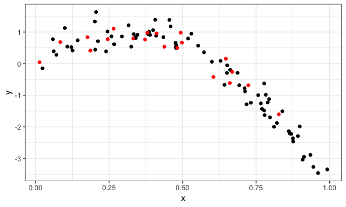

``` r

# we will the black points to fit the model and see how the model predict from the point of red
```

Fit a few models...

``` r
# linear model fit
lin_mod = lm(y ~ x, data = train_df)

# gam fits smooth curves through lines
nonlin_mod = mgcv::gam(y ~ s(x), data = train_df)

# not a good idea
wiggly_mod = mgcv::gam(y ~ s(x, k = 30), sp = 10e-6, data = train_df)
```

Show what these look like:

``` r
# not complex enough
train_df %>% 
  # add the prediction to the dataframe
  add_predictions(lin_mod) %>% 
  ggplot(aes(x = x, y = y)) + geom_point() + 
  geom_line(aes(y = pred), color = "red")
```

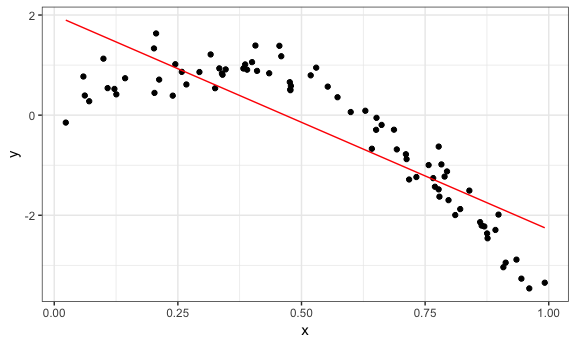

``` r
# this is pretty good
train_df %>% 
  add_predictions(nonlin_mod) %>% 
  ggplot(aes(x = x, y = y)) + geom_point() + 
  geom_line(aes(y = pred), color = "red")
```

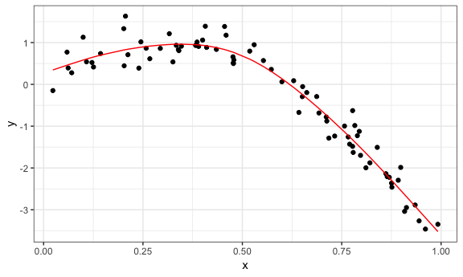

``` r
# this going out of the way to fit, not a great fit. Too complex
train_df %>% 
  add_predictions(wiggly_mod) %>% 
  ggplot(aes(x = x, y = y)) + geom_point() + 
  geom_line(aes(y = pred), color = "red")
```

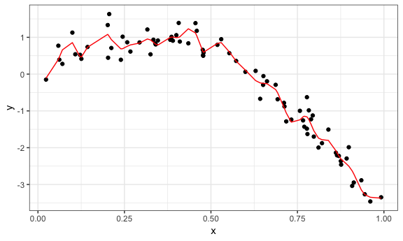

Make all the plots toghter

``` r
train_df %>% 
  gather_predictions(lin_mod, nonlin_mod, wiggly_mod) %>% 
  mutate(model = fct_inorder(model)) %>% 
  ggplot(aes(x = x, y = y)) + 
  geom_point() + 
  geom_line(aes(y = pred), color = "red") + 
  facet_wrap(~model)
```

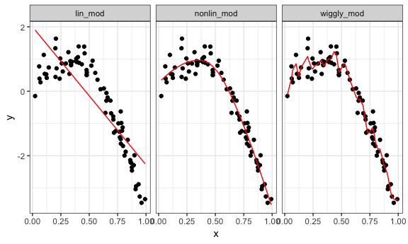

Root-mean-squared-error

We are interested in root-mean-squared-error in test dataset

``` r
# ?rmse
rmse(lin_mod, test_df)
## [1] 0.7163422
## [1] 0.7163422
rmse(nonlin_mod, test_df)
## [1] 0.2437012
## [1] 0.2437012
rmse(wiggly_mod, test_df)
## [1] 0.3471883
## [1] 0.3471883
```

### Iterate!!

Repeat the data for bunch of random partitions

``` r
# generate a bunch of partitions: give the dataset and number of the time you want to repeat the training test split, and each time do it at random, by fault to have 80% of the dataset for traning date, 20% of the datase for test data
cv_df = 
  crossv_mc(nonlin_df, 100) 
```

``` r
cv_df %>% pull(train) %>% .[[1]] %>% as_tibble()
## # A tibble: 79 x 3
##       id     x       y
##    <int> <dbl>   <dbl>
##  1     1 0.266  1.11  
##  2     2 0.372  0.764 
##  3     3 0.573  0.358 
##  4     5 0.202  1.33  
##  5     7 0.945 -3.27  
##  6     8 0.661 -0.615 
##  7     9 0.629  0.0878
##  8    11 0.206  1.63  
##  9    12 0.177  0.836 
## 10    14 0.384  0.938 
## # ... with 69 more rows
cv_df %>% pull(test) %>% .[[5]] %>% as_tibble()
## # A tibble: 21 x 3
##       id     x      y
##    <int> <dbl>  <dbl>
##  1     1 0.266  1.11 
##  2     5 0.202  1.33 
##  3    11 0.206  1.63 
##  4    13 0.687 -0.291
##  5    31 0.482  0.498
##  6    39 0.724 -0.684
##  7    48 0.477  0.514
##  8    52 0.861 -2.14 
##  9    62 0.294  0.861
## 10    64 0.332  0.794
## # ... with 11 more rows
```

``` r
# change the train and test set to ba a tibble
cv_df =
  cv_df %>% 
  mutate(train = map(train, as_tibble),
         test = map(test, as_tibble))
```

``` r
cv_df = 
  cv_df %>% 
  mutate(lin_mod = map(train, ~lm(y ~ x, data = .x)),
         nonlin_mod = map(train, ~mgcv::gam(y ~ s(x), data = .x)),
         wiggly_mod = map(train, ~mgcv::gam(y ~ s(x, k = 30), sp = 10e-6, data = .x))) %>% 
  mutate(rmse_lin = map2_dbl(lin_mod, test, ~rmse(model = .x, data = .y)),
         # for the rmse funtion, we have two inputs: fitted model and dataset, so use "map2"
         # use "maps_dbl" to get the number 
         rmse_nonlin = map2_dbl(nonlin_mod, test, ~rmse(model = .x, data = .y)),
         rmse_wiggly = map2_dbl(wiggly_mod, test, ~rmse(model = .x, data = .y)))
```

Summarize results...

``` r
cv_df %>% 
  select(.id, starts_with("rmse")) %>% 
  ## tidy the data before make a plot
  gather(key = model, value = rmse, rmse_lin:rmse_wiggly) %>% 
  mutate(model = str_replace(model, "rmse_", ""),
         model = fct_inorder(model)) %>% 
  ggplot(aes(x = model, y = rmse)) + geom_violin()
```

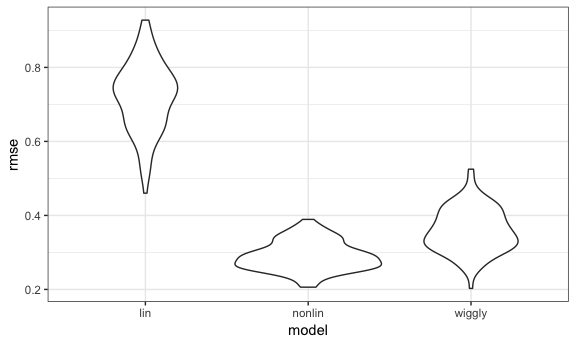

### Child growth

``` r
child_growth = read_csv("./data/nepalese_children.csv")
## Parsed with column specification:
## cols(
##   age = col_integer(),
##   sex = col_integer(),
##   weight = col_double(),
##   height = col_double(),
##   armc = col_double()
## )
skimr::skim(child_growth)
## Skim summary statistics
##  n obs: 2705 
##  n variables: 5 
## 
## -- Variable type:integer --------------------------------------------------------------------
##  variable missing complete    n  mean    sd p0 p25 p50 p75 p100
##       age       0     2705 2705 36.04 13.68 13  24  36  48   60
##       sex       0     2705 2705  1.47  0.5   1   1   1   2    2
##                                              hist
##  <U+2587><U+2587><U+2586><U+2587><U+2587><U+2586><U+2587><U+2586>
##  <U+2587><U+2581><U+2581><U+2581><U+2581><U+2581><U+2581><U+2587>
## 
## -- Variable type:numeric --------------------------------------------------------------------
##  variable missing complete    n  mean   sd   p0  p25  p50  p75  p100
##      armc       0     2705 2705 13.85 1.14  8.5 13.2 13.9 14.5  17.7
##    height       0     2705 2705 84.88 9.63 58.8 77.3 84.7 92.3 114  
##    weight       0     2705 2705 10.94 2.46  4.2  9.1 11   12.7  19.8
##                                              hist
##  <U+2581><U+2581><U+2581><U+2583><U+2587><U+2586><U+2582><U+2581>
##  <U+2581><U+2583><U+2587><U+2587><U+2586><U+2586><U+2582><U+2581>
##  <U+2581><U+2583><U+2587><U+2587><U+2587><U+2583><U+2581><U+2581>
```

``` r
child_growth %>% 
  ggplot(aes(x = weight, y = armc)) + 
  geom_point(alpha = .3)
```

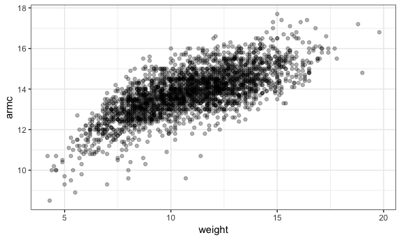

Is this nonlinear?

``` r
child_growth =
  child_growth %>% 
  mutate(weight_sp = (weight > 7) * (weight - 7))
```

``` r
lin_mod = lm(armc ~ weight, data = child_growth)
# piecewise linear model 
pwl_mod = lm(armc ~ weight + weight_sp, data = child_growth)
nonlin_mod = gam(armc ~ s(weight), data = child_growth)
```

Plot all model fits ...

``` r
child_growth %>% 
  gather_predictions(lin_mod, pwl_mod, nonlin_mod) %>% 
  mutate(model = fct_inorder(model)) %>% 
  ggplot(aes(x = weight, y = armc)) + 
  geom_point(alpha = .5) +
  geom_line(aes(y = pred), color = "red") + 
  facet_grid(~model)
```

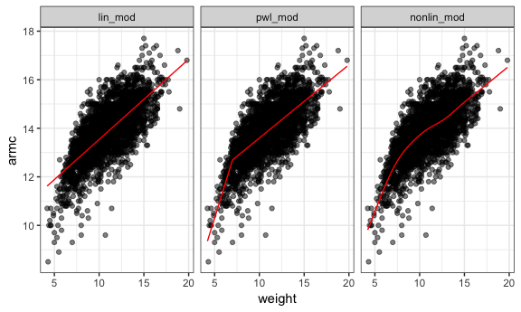

Constructing training / testing splits

``` r
cv_df = 
  crossv_mc(child_growth, 100) %>% 
  mutate(train = map(train, as_tibble),
         test = map(test, as_tibble))
```

``` r
cv_df = 
  cv_df %>% 
  mutate(lin_mod = map(train, ~lm(armc ~ weight, data = .x)),
         pwl_mod = map(train, ~lm(armc ~ weight + weight_sp, data = .x)),
         nonlin_mod = map(train, ~gam(armc ~ s(weight), data = as_tibble(.x)))) %>% 
  mutate(rmse_lin    = map2_dbl(lin_mod, test, ~rmse(model = .x, data = .y)),
         rmse_pwl = map2_dbl(pwl_mod, test, ~rmse(model = .x, data = .y)),
         rmse_nonlin = map2_dbl(nonlin_mod, test, ~rmse(model = .x, data = .y)))
```

Look at results..

``` r
cv_df %>% 
  select(starts_with("rmse")) %>% 
  gather(key = model, value = rmse) %>% 
  mutate(model = str_replace(model, "rmse_", ""),
         model = fct_inorder(model)) %>% 
  ggplot(aes(x = model, y = rmse)) + geom_violin()
```

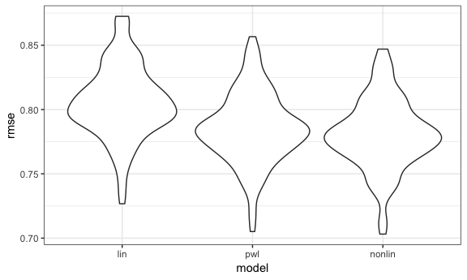

``` r
# to double check if your predict model is doing better than absolutly nothing
cv_df = 
  cv_df %>% 
  mutate(int_mod = map(train, ~lm(armc ~ 1, data = .x)),
         lin_mod = map(train, ~lm(armc ~ weight, data = .x)),
         pwl_mod = map(train, ~lm(armc ~ weight + weight_sp, data = .x)),
         nonlin_mod = map(train, ~gam(armc ~ s(weight), data = as_tibble(.x)))) %>% 
  mutate(rmse_int    = map2_dbl(int_mod, test, ~rmse(model = .x, data = .y)),
         rmse_lin    = map2_dbl(lin_mod, test, ~rmse(model = .x, data = .y)),
         rmse_pwl = map2_dbl(pwl_mod, test, ~rmse(model = .x, data = .y)),
         rmse_nonlin = map2_dbl(nonlin_mod, test, ~rmse(model = .x, data = .y)))

cv_df %>% 
  select(starts_with("rmse")) %>% 
  gather(key = model, value = rmse) %>% 
  mutate(model = str_replace(model, "rmse_", ""),
         model = fct_inorder(model)) %>% 
  ggplot(aes(x = model, y = rmse)) + geom_violin()
```

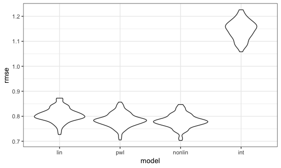

``` r
# it's great because at very least, the model you predict is much better than doing absolutly nothing
```
